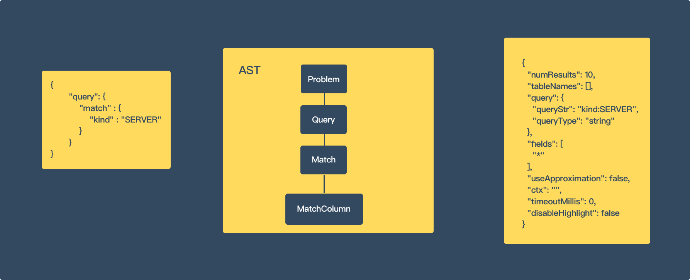
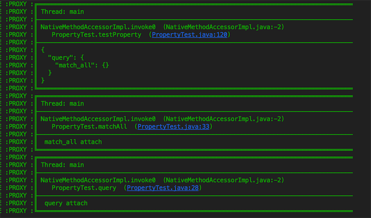
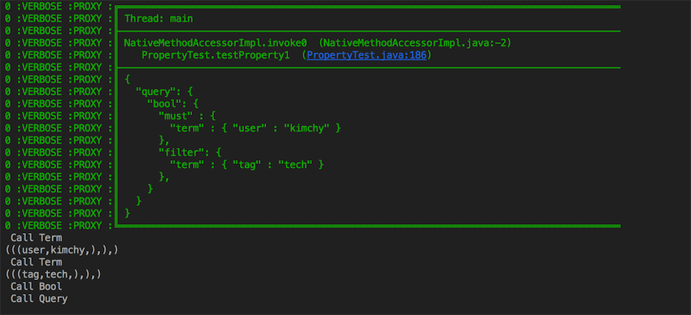

# EtD Proxy FrameWork



* Input：

  ``` json
  {
         "query": {
             "match" : {
                 "kind" : "SERVER"
             }
         }
  }
  ```

* Output:

  ``` json
  {
    "numResults": 10,
    "tableNames": [],
    "query": {
      "queryStr": "kind:SERVER",
      "queryType": "string"
    },
    "fields": [
      "*"
    ],
    "useApproximation": false,
    "ctx": "",
    "timeoutMillis": 0,
    "disableHighlight": false
  }
  ```
## AST 结构 

``` javascript
// AstObject -> Property List
{
  // => Property List
  // => Primary Property => [ StringLiterial, Literial]
  "bool": true,
  // => Array Property => [ Literial List ] | [ AstObject List ] | [ AstValueList List ]
  // => Array Property is List
  "array": [
      
   ],
  // => Object Property => AstObject 
  "object": {
  	    
  }
}
```

## 语法定义

可以通过注解的方式为解析器增加语法，增加的语法是一种类似的 JSON 语法：

``` java
    @Bind(name = "match_all", mode = OBJECT, prefix = "query")
    public void matchAll(AstObjectProperty property, Context context) {

    }
```

* `name` 表示当前添加的语法描述。
* `mode` 表示添加的语法类型，语法类型包含四种，`[ WRAPPER, OBJECT, PRIMARY, ARRAY] ` 其中 Wrapper 代表最外层对象，Object 代表添加的是一个对象类型，Primary 代表字面量类型，Array 代表数组类型。
* `prefix` 代表语法前缀，当前的 node 在哪个对象之下。
* `insert` 代表插入的语法规则，适用于递归的语法定义（目前用于嵌套的 Query Context）

### 示例 1

比如我们需要支持语法：

``` javascript
{
  "query": {
    "match_all": {}
  }
}
```

可以编写下列的语法规则：

``` java
@Bind(name = "wrapper", mode = WRAPPER)
public void wrapper(AstQueryProgram property, Context context) {
    Logger.v(" wrapper attach ");
}

@Bind(name = "query", mode = OBJECT, prefix = "wrapper")
public void query(AstObjectProperty property, Context context) {
    Logger.v(" query attach ");
}

@Bind(name = "match_all", mode = OBJECT, prefix = "query")
public void matchAll(AstObjectProperty property, Context context) {
    Logger.v(" match_all attach ");
}
```

打印的输出结果：




### 示例 2

这里出现了递归，`must` 后面的 Object 实际上支持 `query` 的语法：

``` javascript
{
  "query": {
    "bool": {
      "must" : {
        "term" : { "user" : "kimchy" }
      },
      "filter": {
        "term" : { "tag" : "tech" }
      },
    }
  }
}
```

可以编写下列的语法规则：

``` java
@Bind(name = "wrapper", mode = WRAPPER)
public void wrapper(AstQueryProgram property, Context context) {
    System.out.println(" Call Wrapper ");
}

@Bind(name = "query", mode = OBJECT, prefix = "wrapper")
public void query(AstObjectProperty property, Context context) {
    System.out.println(" Call Query ");
}

@Bind(name = "term", mode = OBJECT, prefix = "query")
public void term(AstObjectProperty property, Context context) {
    System.out.println(" Call Term ");
}

@Bind(name = "bool", mode = OBJECT, prefix = "query")
public void bool(AstObjectProperty property, Context context) {
    System.out.println(" Call Bool ");
}

@Bind(name = "must", mode = OBJECT, prefix = "bool", insert = "query")
public void must(AstObjectProperty property, Context context) {
    System.out.println(property.object()
                               .property("term")
                               .valueNode()
                               .toString());
}

@Bind(name = "filter", mode = OBJECT, prefix = "bool", insert = "query")
public void filter(AstObjectProperty property, Context context) {
    System.out.println(property.object()
                               .property("term")
                               .valueNode()
                               .toString());
}
```

打印的输出结果：



